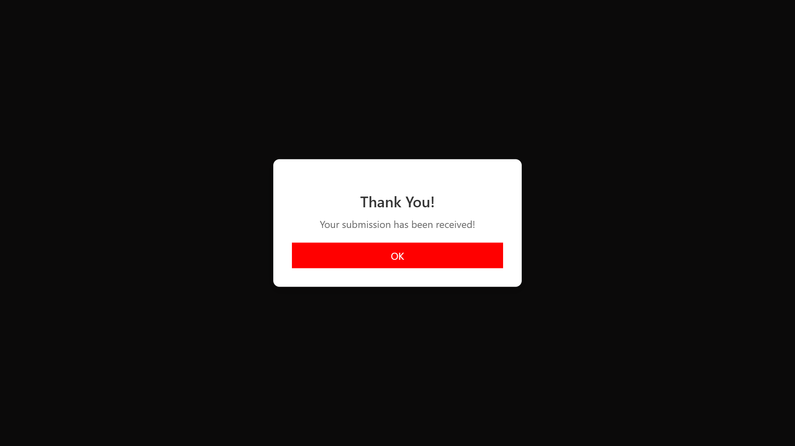

# 🚀 Modal popup

This project is a clean, modern modal popup built with HTML5, CSS3, and vanilla JavaScript. It features a "Submit" button that, when clicked, displays a centered popup and a semi-transparent overlay. The modal includes a custom icon, a thank-you message, and an "OK" button to close it. The popup can also be dismissed by clicking the overlay, offering a smooth and user-friendly experience. The design is fully responsive and uses CSS transitions for a polished feel.

---

## 📌 Live Demo

🔗 [Click here to view the project](https://sumitsharmawb.github.io/07_Modal/)

---

## 🖼️ Preview

---

## 🛠️ Tech Stack

- **HTML5**
- **CSS3**
- **JavaScript (Vanilla JS)**
